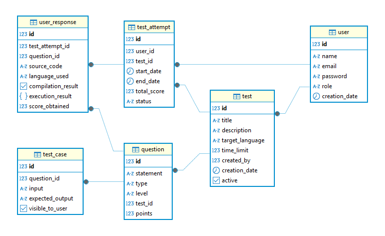

# Encoder Test API

  <p align="center">API services for encoder test</p>
<p align="center">
  <a href="https://www.java.com" target="_blank"></a>
  <a href="https://spring.io/" target="_blank"></a>
  <a href="https://maven.apache.org/" target="_blank"></a>
  <a href="https://site.mockito.org" target="_blank"></a>
  <a href="https://www.postgresql.org" target="_blank"></a>
  <a href="https://swagger.io" target="_blank"></a>
  <a href="https://developer.mozilla.org/en-US/docs/Web/API/WebSockets_API" target="_blank"></a>
</p>

## Introduction

The **Encoder Test API** is designed to provide a robust and efficient way to encode and decode data using various algorithms. This project is built using Java and PostgreSQL, ensuring high performance and reliability.

## Technologies Used

- **Java 17**: The core programming language used for developing the API.
- **Spring Boot**: Framework for building stand-alone, production-grade Spring-based applications.
- **Spring Data JPA**: Simplifies data persistence and database operations.
- **Spring Security**: Provides authentication and authorization features.
- **Spring Validation**: For validating user input and data.
- **Spring WebSocket**: Enables real-time, bidirectional communication between client and server.
- **PostgreSQL**: Used for database management, providing a reliable and scalable solution.
- **JWT (io.jsonwebtoken)**: For JSON Web Token creation and validation.
- **Lombok**: Reduces boilerplate code with annotations (optional, for development).
- **SpringDoc OpenAPI**: For automatic generation of OpenAPI documentation (Swagger UI).
- **Mockito**: Testing framework for Java.
- **JaCoCo**: Code coverage library for Java.
- **Maven**: Build automation tool used primarily for Java projects.

## Installation

1. **Clone the repository**:
   ```bash
   git clone https://github.com/desobsesor/encoder-test-api.git
   ```

2. **Navigate to the project directory**:
   ```bash
   cd encoder-test-api
   ```

3. **Run the application**:
   ```bash
   mvn spring-boot:run
   ```


## Testing and Code Coverage

To run tests and generate the coverage report with JaCoCo:

```bash
mvn clean test
```

## Deployment DB

1. **Ensure PostgreSQL is installed and running**.
2. **Create the database**:
   ```sql
   CREATE DATABASE encoder_test_db;
   ```
3. **Run the schema and data scripts**:
   ```bash
   psql -U postgres -d encoder_test_db -f schema.sql
   psql -U postgres -d encoder_test_db -f data.sql
   ```
## Preview ER

<p align="center">
  
</p>

### WebSocket Login Notification System

This application includes a WebSocket mechanism to notify web clients immediately after successful login events. The system follows clean architecture principles and maintains modularity by placing WebSocket-related logic in independent, appropriately named files. For detailed documentation on the WebSocket implementation, please refer to the WebSocket module README located at `src/main/java/com/cds/encodertestapi/infrastructure/adapter/websocket/README.md`.

## Built with 🛠️

_Tools and Technologies used_
- [Java](URL_ADDRESS.java.com/) - Java is a high-level, class-based, object-oriented programming language
- [Spring Boot](URL_ADDRESS.io/projects/spring-boot) - Spring Boot makes it easy to create stand-alone, production-grade Spring based Applications that you can "just run".
- [Spring WebSocket](https://docs.spring.io/spring-framework/reference/web/websocket.html) - Spring WebSocket proporciona soporte para comunicación bidireccional en tiempo real entre cliente y servidor.
- [Swagger](https://swagger.io/) -Swagger is an open specification for defining APIs
- [PostgreSQL](https://https://www.postgresql.org/) - PostgreSQL is a powerful, open-source object-relational database system
- [Mockito](https://mockito.org) - Mockito is a testing framework for Java.
- [Maven](https://apache.org/) - Maven is a build automation tool used primarily for Java projects.

## API Documentation

Detailed API documentation can be found in the `docs` directory.

## Contributing

Contributions are welcome! Please fork the repository and submit a pull request.

## Additional Notes

- The project includes example data for testing purposes.
- Ensure all dependencies are up-to-date before deployment.

---

Feel free to reach out for any questions or contributions.


## Versioned 📌

[SemVer](http://semver.org/) is used for versioning. For all versions available.

## Documentation API 📖

http://localhost:8081/swagger-ui/index.html

## Author ✒️

_Built by_

- **Yovany Suárez Silva** - _Full Stack Software Engineer_ - [desobsesor](https://github.com/desobsesor)
- Website - [https://portfolio.cds.net.co](https://desobsesor.github.io/portfolio-web/)

